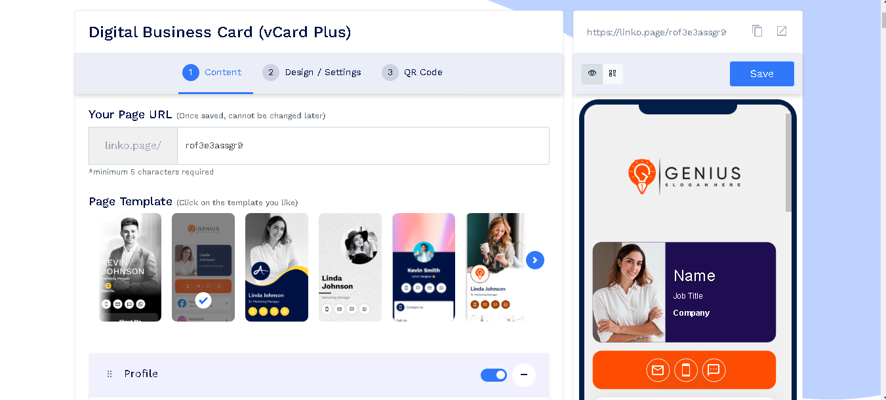
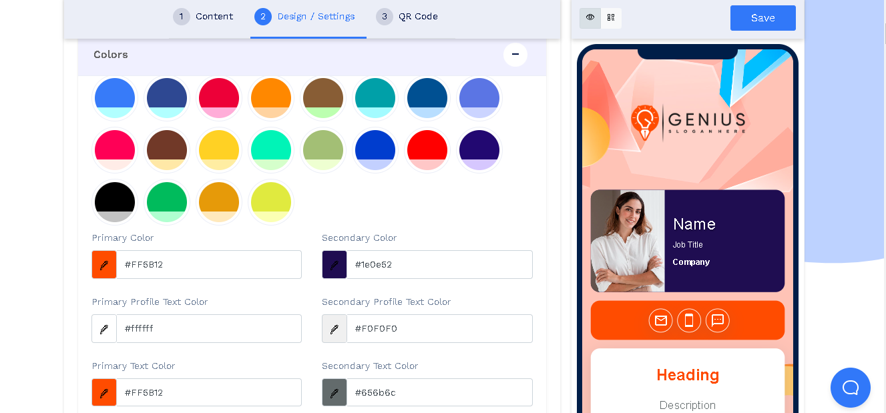
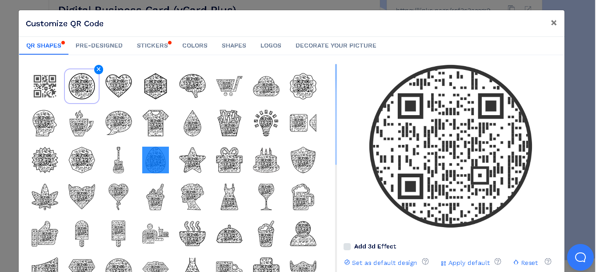
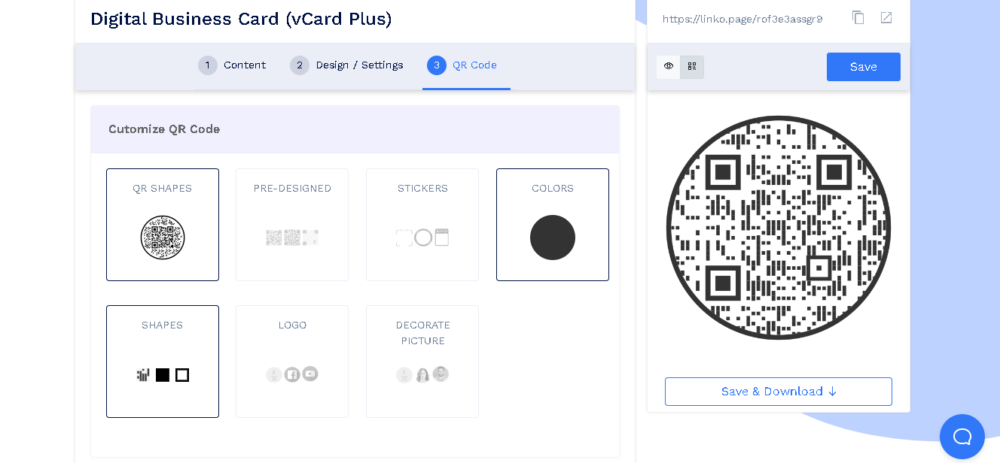

# Digital Business Card

> Generates digital business card.
> Live demo [_here_](https://www.qrcodechimp.com/digital-business-card).

## Table of Contents

- [General Info](#general-information)
- [Technologies Used](#technologies-used)
- [Features](#features)
- [Screenshots](#screenshots)
- [Setup](#setup)
- [Usage](#usage)
- [Project Status](#project-status)
- [Room for Improvement](#room-for-improvement)
- [Acknowledgements](#acknowledgements)
- [Contact](#contact)

## General Information

- This project helps people to generate & design awesome digital business card.
- Save time & cooler design
- Purpose is to make clients to feel comfortable & flexible on making their own digital business card.
- The project idea was good & design was awesome so I undertook it.

## Technologies Used

- Tech 1 - CodeIgniter
- Tech 2 - Javascript
- Tech 3 - CSS

## Features

List the ready features here:

- Prebuilt templates
- Component management
- QRCode generator

## Screenshots

## Setup

This is CodeIgniter based project.
You have to use composer to install vendor.
Dependencies are listed on composer.json.

1. Clone the project by using `git clone` command.
2. And inside the project run `composer update`.

## Usage

You can use this to store personal information as digital business card.

## Project Status

Project is: _complete_.

## Room for Improvement

These are room for improvement & ToDos.

Room for improvement:

- CodeIgniter 4
- Javascript for UI
- Component Management Idea
- JSON data process

To do:

- Frontend as React or Vue
- Code Quality

## Acknowledgements

- This project was inspired by ADMIN.
- This project was based on [this tutorial](https://codeigniter.com/).
- Many thanks to ADMIN.

## Contact

Created by [Bohdan Drzod](https://softdev629.github.io) - feel free to contact me!
